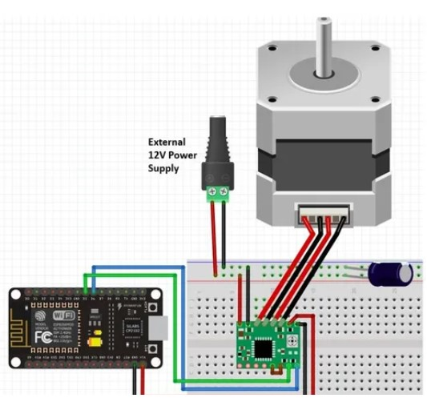
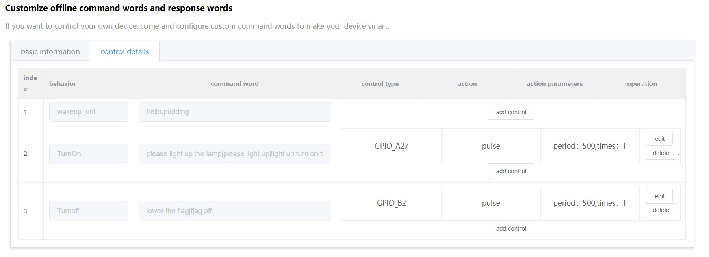
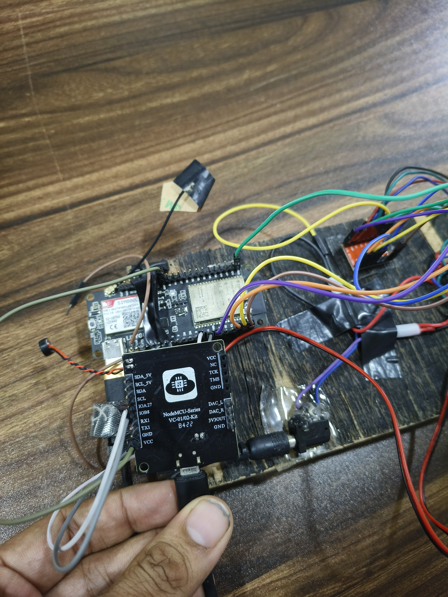
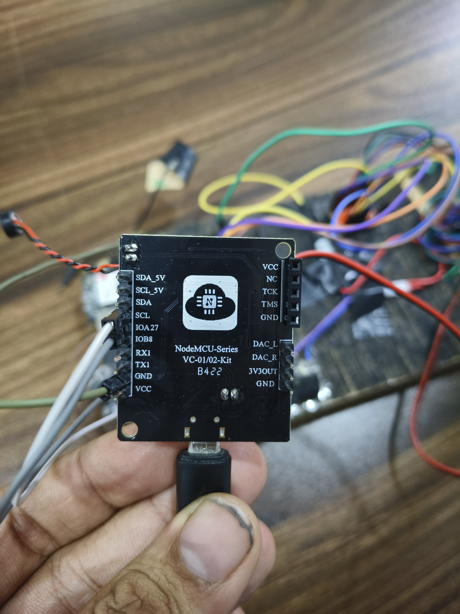

# HAPPY INDEPENDENCE DAY

## Introduction

Its a fun project to Host Flag using voice commands.

### Hardwares Used

- ESP32
- VC-02
- Stepper Motor
- Motor driver A4988

### Softwares & Other tools Used

- Arduino IDE
- http://voice.ai-thinker.com/  VC-02 Audio custom generator

# Pin Connections ESP32

| ESP32 Pin     | Connected To                         | Description                                  |
|---------------|--------------------------------------|----------------------------------------------|
| 22            | Stepper Driver A4988 DIR Pin         | Controls the direction of the stepper motor  |
| 23            | Stepper Driver A4988 STEP Pin        | Controls the stepping sequence of the motor  |
| 19 (flagup)   | VC02 A27                             | Indicates the flag is up (connection to A27) |
| 18 (flagdown) | VC02 B2                              | Indicates the flag is down (connection to B2)|

## Pin Connections A4988 Driver

| A4988 Pin         | Connected To                  | Description                                       |
|-------------------|-------------------------------|---------------------------------------------------|
| DIR (Direction)   | ESP32 Pin 22                  | Controls the direction of the stepper motor       |
| STEP (Step)       | ESP32 Pin 23                  | Controls the stepping sequence of the motor       |
| VMOT (Motor Power)| External Power Supply (+)     | Provides power to the motor (usually 8-35V)       |
| GND (Ground)      | Power Supply Ground (-)       | Common ground for the circuit                     |
| VDD (Logic Power) | ESP32 3.3V                    | Provides logic level power to the A4988 (3.3V/5V) |
| ENABLE            | ESP32 3.3V                    | Can be used to enable/disable the motor driver    |
| MS1, MS2, MS3     | Ground/High (as needed)       | Microstepping resolution configuration            |
| SLEEP             | Short Sleep SLEEP & RESET     | Put the driver in sleep mode to save power        |
| RESET             | Connected to SLEEP (optional) | Resets the driver (often tied to SLEEP)           |

### Video

https://www.linkedin.com/posts/akshayembedded_tricolor-independenceday2024-india-activity-7229726739705253889-6n8b?utm_source=share&utm_medium=member_desktop

### Images

